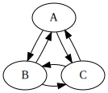

# hoge

## 数式

$1+1=2$

$$
\begin{aligned}
    1 + 1 &= 2 \\
    &=2
\end{aligned}
$$

## 画像



## コード

### C言語

C言語でハローワールド

```c
#include <stdio.h>

int main() {
    printf("hello, world\n");
    return 0;
}
```

## 日本語

数式でも日本語が普通に使えるのか気になる

$$
\text{人生}=\text{虚無}
$$
