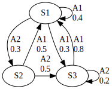
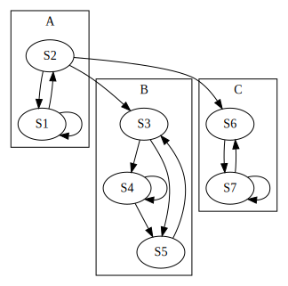
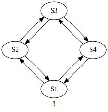

# 02 Information Resource

## 情報源

### 情報源のモデル

今まで確率的に生起する事象を扱ってきましたが,実際の事象は一回で終わらず事象が系列となり,次々と起こります

しかも,これから出てくる事象は今までに発生した事象に依存して確率的に定まることが多いです

このようにこれから出てくる情報が過去の情報に依存して確率的に定まるものを**情報源**と言います

情報源が時刻1ごとに1つの事象を発生するとします

情報源は$k$個の事象$A_1, A_2,...,A_k$を手持ちとして,このうちの一つを出すと考えます

天気の場合,事象それぞれが天候の名称です.$A_1=\text{晴れ}$, $A_2=\text{曇り}$とすると事象$A_1$が連続して何回も起こるというのは確率的に難しいでしょう(もちろんここでは単純化して話しています)

#### 英語の例

英語の場合,情報源の手持ちの事象にはアルファベット26文字と句読点があり,これらが確率的に出ていると考えれば良いです

### 一般化

以降では$k$個の事象...と言う代わりに現れる文字の全体$\{A_1,A_2,...,A_k\}$のことをアルファベットと呼びます

天気の場合は｢晴れ｣や｢曇り｣など天候の名称がアルファベットです

時刻$t$($t=1,2,3,...$)に発生する文字を$x_t$で表すとします.これが$A_i$ならば,

$$
x_t=A_i
$$

です

それ以前に出てきた$s$個($s=1,2,3,...$)の文字の系列が

$$
x_{t-s}...x_{t-2}x_{t-1}
$$

であるとき,時刻$t$に文字$x_t$の出る確率は

$$
p(x_t \mid x_{t-s}...x_{t-1})
$$

と書くことにします

また,時刻$t-s\sim t$に文字系列

$$
x_{t-s}...x_{t-1}x_t
$$

が出る確率は

$$
p(x_{t-r}...x_t)
$$

と書くことにします

このとき

$$
p(x_{t-s}...x{t-1}x{t}=p(x_t \mid x_{t-s}...x_{t-1})p(x_{t-s}...x_{t-1})
$$

です

これで文字系列を発生し続ける情報源の確率的な性質がわかります

### 定常的な情報源

ここでは情報源の性質が変わらないことを仮定しています

例えば,情報源が英語から日本語に変わってしまったらこれまでの文字系列が持つ意味はほとんど意味がなくなってしまいます

このような情報源の性質が時間が経っても変わらないことは,条件付き確率$p(x_t \mid x_{t-s}x_{t-1})$は$t$がなんであっても同じです

つまり$r=1,2,...$に対して

- $p(x_{t+r})=p(x_t)$
- $p(x_{t+r} \mid x_{t+r-s}...x_{t+r+1}) = p(x_t \mid x_{t-s}...x_{t-1})$

を意味します

このような情報源のことを**定常的な情報源**と言います

### 情報源のエントロピー

時刻$t$に文字$x_t$が出る確率は$p(x_t)$だから,このエントロピーは

$$
H(X_t)= -\sum p(x_t)\log p(x_t)
$$

で与えられます

大文字$X_t$は時刻$t$の$x_t$を表す確率変数です

情報源は定常的だからこれは

$$
H(X) = - \sum_x p(x)\log p(x)
$$

と書けます.また

$$
H(X) = \sum_i p(x=A_i)\log p(x=A_i)
$$

と書けます

これは情報源1文字あたりのエントロピーではありません.なぜなら情報源から出てくる文字の系列を考える場合,$x_t$は$x_{t-1}, x_{t-2},...$の文字と相互に影響していてその影響を無視できないからです

そこで,情報源から出る相続いた2文字$x_1 x_2$を見ます

2文字のエントロピーは

$$
H(X_1 X_2)= - \sum_{x_1 x_2}p(x_1 x_2)\log p(x_1 x_2)
$$

と書けます

2文字の間に相関がある場合,このエントロピーは文字を1つずつ独立に見たときのエントロピー$2H(X)$よりは小さいです.つまり

$$
H(X_{1}X_{2}) \leq 2H(X)
$$

同様に,$n$個の相続いた文字の系列を見たときのエントロピーは

$$
H(X^n) = - \sum_{x^n}p(x^n)\log p(x^n)
$$

です.ただし,ここでは

$$
X^n = X_1 X_2... X_n\\
x^n = x_1 x_2... x_n
$$

です

ここでは$n$個で$H(X^n)$のエントロピーを1文字ずつに割り振ったとき

$$
H_n　= \frac{H(x^n)}{n}
$$

が1つ当たりのエントロピーとなります

$n$個の文字$x^n=x_1 x_2...x_n$の間に相関がなければ,これは$H(X)$に等しいが,相関があれば$H_n$は$n$と共に減少していきます

これは｢日本大学経済学｣の次の文字が｢部｣だと予想がつくことからもわかるでしょう

ここで情報源の1文字当たりのエントロピー$H$を

$$
H=\lim_{n \to \infty} H_n
$$

と定義します.これは情報源から出る文字系列のずっと長い間見続けたいときの1文字当たりのエントロピーです

次のようにも考えられます.今までに出た$n$個の文字を覚えているとして,次の文字がなんであるかと考えるときのエントロピー,条件付きエントロピーは

$$
H(X \mid X^n) = - \sum p(x^n) p(x \mid x^n) \log p(x \mid x^n)
$$

となります.このとき情報源のエントロピーを

$$
\lim_{n \to \infty}H(X \mid X^n) = H(X \mid X^{\infty})
$$

で定義します.これも$n$と共に単調減少します

これは先に定義した$H$に収束します

この証明は

$$
H(X^n)=H(X)+H(X \mid X)+H(X \mid X^2)+...+H(X \mid X^{n-1})
$$

からすることが可能です

#### 英語の例

英語のアルファベットの26個が全て等確率で独立に発生すると仮定すると,このエントロピーは

$$
H_0 = \log_2 26 = 4.7\text{ビット}
$$

です

実際の出現頻度を調べた結果を元にすると

$$
H_1 = 4.15\text{ビット}
$$

となります.しかしこれも前後の文字の影響が入っていないのでそれも考慮すると,英語の2文字の組み合わせ$x^2=x_1 x_2$の全ての頻度を調べ,$H_2$を求めると

$$
H_2 = 3.57\text{ビット}
$$

となります.同様に8文字の文字系列$x_8 = x_1 x_2 ... x_8$の全ての出現頻度を調べると

$$
H_8 = \frac{1}{8} H(X^8) = - \frac{1}{8}\sum p(x^8)\log p(x^8)
$$

と計算できるようです.これによると

$$
H_8 = 2.35 \text{ビット}
$$

となるようです

しかし,現実では文章の始めの方では話の予想はつかないが,最後の方では予想が付くことが多いです(推理小説など)

そのため,大方の予想では

$$
H=1.3\text{ビット}
$$

程度ということになっているそうです

## マルコフ的情報源

これまでに扱ったものは実際問題として求めるのは非常に困難です

加えて,現実の情報源を忠実に表しているのではなく近似をしているに過ぎません

どうせ近似ならばもっと扱いやすいものにした方がよいということで登場するのが**マルコフ的情報源**です

マルコフ的情報源とはいくつかの**内部状態**を持った情報源のことです

この内部状態を$S_1, S_2,...,S_r$で表します

今,$S_{\alpha}$にあったとします.すると次の時刻には情報源は確率$p_{\beta \alpha}$で状態$S_{\beta}$に遷移し文字$A_i$を発生します

状態$S_{\alpha}$にあるときに文字$A_i$を発生する確率を$q_{i \alpha}$とします

今度は状態$S_{\beta}$にいます.このとき確率確率$p_{\gamma \beta}$で状態$S_{\gamma}$に遷移し,文字$A_j$を発生します

状態$S_{\beta}$にあるときに文字$A_j$の出る確率は$q_{j \beta}$です

このように逐次確率的に状態を移行しながら文字を発生し発生する文字の確率分布はその時の状態に依存しているような情報源を**マルコフ的情報源**と言います

マルコフ的情報源は**状態遷移図**で説明するとわかりやすいです

以下の図は状態が$S1,S2,S3$の3つであるようなマルコフ的情報源を表す遷移図です

* 状態は丸で囲われる
* 状態の遷移の確率は矢印の上に書かれている

という特徴が有ります

図1では

- 状態に関して
  - S1からS1になる確率$p_{11}$は$0.4$
  - S1からS2になる確率$p_{12}$は$0.3$
  - S1からS3になる確率$p_{13}$は$0.3$
- 文字に関して
  - S1から遷移する時に文字$A_1$が出る確率は$0.7$

などがわかります

マルコフ的情報源ではこれから発生する文字の確率分布は現在の情報源の状態だけで定まるので議論がしやすいです

これ以前に紹介した情報源も過去に出た$s$個の文字の組$A_{i1}A_{i2}...A_{is}$をひとまとめにしたものを情報源の内部状態と考えることができます

つまりに過去に$A_{i1}A_{i2}...A_{is}$の文字系列が出たということは情報源が今状態$S_{\alpha}=A_{i1}...A_{is}$にあると見ることができます.次に文字$A_i$が出る確率$q_{i\alpha}$は

$$
q_{i\alpha} = p(A_i \mid A_{i1}...A_{is})
$$

と書けます

文字$A_{i}$が出た後に文字系列に$A_i$が新たに付け加えられ,その代わりに一番古い文字$A_{i1}$が削除されるので情報源の状態は

$$
s_{\alpha} = A_{i1}A_{i2}...A_{is} \to s_{\beta} = A_{i2}...A_{is}A_{i}
$$

に変わります.この状態遷移の確率$p_{\beta \alpha}$は文字$A_i$の出る確率$q_{i \alpha}$に等しいです

文字の出現確率が無限の過去を元によるわけではないので,ここでは$s$の値を十分に大きく取ればマルコフ的情報源に近似することができると考えられています

しかし,$s$が100や1000のように大きな数だと状態が多すぎて確率の計算が大変になってしまいます.あくまで｢理論上｣の話であり,理論上の考察は楽になります

### マルコフ連鎖

マルコフ的情報源では過去の影響は全て状態の中に取り入れられるので,状態の推移を調べることが重要です

このように現在の状態に依存して確率的に状態が遷移していく過程のことを**マルコフ連鎖**と言います

図2のような状態遷移図を持つマルコフ連鎖を例にその性質を考えてみます

このマルコフ連鎖は7つの状態から成ります

ここでBという枠に囲まれた状態に落ち込むと外に出ることはできません.このような性質を持つ状態の部分集合をマルコフ連鎖の**閉部分集合**と言います

B以外にCも閉部分集合です

Bに落ち込んでしまうと外の状態に行くことはできませんが,B内部の状態は相互に行くことができます.このようにお互いにどの状態からどの状態へも行くことのできる閉部分集合のことを,**強連結成分**と言います

Aに含まれる状態を考えます.始めの状態がAの中にあったとしても,時間が立てばいつかは必ずBかCの中に移ってしまいます.このように状態がいつまでもA内にとどまっている確率が0であるような状態のことを**消散部分**と言います

マルコフ連鎖の状態は消散部分といくつかの強連結成分に分けられます.図2ではAが消散部分,BとCが閉強連結成分です

マルコフ連鎖で表される情報源を問題として,この情報源から出る情報の統計的性質を調べようとしているので,時間が経てばなくなってしまう消散部分は無視をしても良いでしょう

これからは閉強連結成分のみを考えることにします

マルコフ連鎖では全体が1つの閉強連結成分になっているものを**分解不可能**と言います.一方,いくつかの部分に分解できるものを**分解可能**と言います

これからは**分解不可能なもの**のみを扱います

### 周期的なマルコフ連鎖

分解不可能なマルコフ連鎖にも次の図3のような変わり種があります

このマルコフ連鎖は以下のような状態をもちます

- ある状態から出発し,元の状態に帰るループに含まれる枝の数が2の倍数
  - 時刻1に$S_1$にいるとき
  - 偶数時刻は$S_2$or$S_4$
  - 奇数時刻は$S_1$or$S_3$

これを**周期的な連鎖**と良います

ループの枝の数の最大公約数$m$を**連鎖の周期**

公約数がないとき,非周期的なマルコフ連鎖と言います

各状態にどのくらいの頻度で現れるかを調べるために状態感の遷移確率$p_{\beta \alpha}$を並べて,遷移確率行列$P$を定義します

$$
P = \left[
    \begin{array}{cccc}
    p_{11} & \ldots & \ldots & p_{\gamma \alpha} \\
    \vdots & \ddots & p_{\beta \alpha} & \vdots \\
    \vdots & & \ddots & \vdots \\
    p_{\gamma 1} & \ldots & \ldots & p_{\gamma \gamma}
    \end{array}
    \right]
$$

と書けます.ただし,$\beta$行$\alpha$列要素は$\alpha$から$\beta$へ移る確率を表します

そして

$$
(p^2)_{\beta \alpha} = \sum_{\gamma}p_{\beta \gamma}p_{\gamma \alpha}
$$

となります($\gamma$は任意の状態)

分解可能で非周期的なマルコフ連鎖では次の補題が成立します

#### 補題

$$
p^{\infty} = \lim_{n \to \infty}p^n
$$

が存在し,$p^{\infty}$は同一の列ベクトル$\boldsymbol{u}$より成ります.つまり

$$
p^{\infty} = [\boldsymbol{u}, \boldsymbol{u},..., \boldsymbol{u}],
\boldsymbol{u} = \left(
    \begin{array}{c}
        u_1\\
        u_2\\
        \vdots\\
        u_r
    \end{array}
    \right)
$$

この$\boldsymbol{u}$は

$$
P\boldsymbol{u} = \boldsymbol{u}\\
\sum u_i = 1, u_i \geq 0
$$

を満たすベクトルで,これより一意に定まります

十分に時間が経てば,どこから出発しても$S_{\alpha}$である確率は$u_{\alpha}$であり,この確率を**定常確率**と言います

分解不可能でも周期的なマルコフ連鎖では$p^{\infty}$は存在しません

これは$p^n$は$n$が大きくなると,周期$m$の振動を起こし収束しないからです.しかし,$\boldsymbol{u}$は存在し,同じ式から求めることができます

### エントロピー

次にマルコフ的情報源のエントロピーを求めます

今,状態$S_{\alpha}$にいるとして,次に出る文字のエントロピーは

$$
H_{\alpha}(X) = - \sum_{i} q_{i \alpha} \log i \alpha
$$

長い時間かかるほど$S_{\alpha}$にいる確率は定常状態$u_{\alpha}$になりエントロピーが$H_{\alpha}(X)$となる確率は$u_{\alpha}$.よって全体の1文字当たりのエントロピーは

$$
H = \sum_{\alpha}u_{\alpha}H_{\alpha}(X)
$$

は,状態がなんであるかわかるという条件での1文字当たりのエントロピー

$$
H_s(X) = - \sum_{\alpha}u_{\alpha}q_{i \alpha}\log i \alpha
$$

に等しいです

## 情報源の冗長度

アルファベットを$k$個持つ情報源のエントロピーは1文字当たり最大

$$
H_0 = \log k
$$

となります.現実には1文字当たり$H$のエントロピーしか出していないとすると,

$$
r = \frac{H_0 - H}{H_0}
$$

だけの情報を損しています.この$r$を**冗長度**と言います

これは無駄なく情報源を用いれば字数が$r%$節約できるということです

## 情報源の大数の法則

文字系列$x_1 x_2...x_N$の出現確率を$p(x_1 x_2...x_N)$と書きます

そして,$x_i$が出現するところで,今までに$x_1 x_2 ... x_{i-1}$という文字系列が発生したとします.このとき$x_i$の発生する確率を$p(x_i \mid ...x_{i-2}x_{i-1})$と書きます

この$x_i$を観測することで得られる情報量は

$$
I_i = \log p(x_i \mid ...x_{i-2}x_{i-1})
$$

であり,$I_i$の期待値を$\bar{I_i}(...x_{i-2}x_{i-1})$として

$$
\bar{I_i}(...x_{i-2}x_{i-1}) = \sum_{x_i}p(x_i \mid ... x_{i-2}x_{i-1})I_i \\
= -  \sum_{x_i}p(x_i \mid ... x_{i-2}x_{i-1})\log p(x_i \mid ...x_{i-2}x_{i-1})
$$

これを更に文字系列$...x_{i-2}x_{i-1}$について平均したものが情報源の1文字当たりのエントロピー

$$
H = \sum_{...x_{i-1}}\sum_{x_i}p(...x_{i-1})p(x_i \mid ... x_{i-1})\log p (x_i \mid ... x_{i-1})
$$

となります.過去の文字系列が全て分かっているとき,これから更に長さ$N$のも時系列$x_1 x_2... x_N$を見て得られる情報量$I$は

$$
I = - \log p(x_1 x_2... x_N \mid x^{\infty})
$$

ただし

$$
p(x_1 x_2... x_N \mid x^{\infty}) = p(x_1 \mid x^{\infty}) ... p(x_N \mid x^{\infty})
$$

このことから

$$
I = - \sum_{i=1}^{N}I_i
$$

と書けます

このとき,$I_i$は全て平均値が$H$の確率変数です.$N$個集めるとおおよそ$NH$に等しくなるので

$$
I \simeq NH
$$

これは確率論の**大数の法則**に相当します

実際に$N$文字の系列1つを見て得られる情報量$I$はちょうど$NH$にはなリマ千.むしろ$N$を大きくすると$NH$からは外れてしまいます.しかし$1/N$は$H$に近付きます

$$
\frac{1}{N} \to H
$$

また,どんな小さい正の数$\varepsilon$に対しても$N$を十分大きく取れば実際に観測される文字系列の情報量はほとんど

$$
I \approx (H \pm \varepsilon)N
$$

に収まります.そのため今後は近似的に$I=NH$とします.

ここで,$I$は文字系列の出現確率を$p$とすると

$$
I = - \log p
$$

です.そのため

$$
\log p \approx (H \pm \varepsilon)N
$$

が導けます.長さ$N$のも時系列は全部で$k^N$個ありますが,この文字系列の全体$L$を2つの部分$L_1$と$L_2$に分けてみます

長さ$N$のも時系列のうち,出現確率$p$が

$$
(H - \varepsilon)N < - \log p < (H + \varepsilon) N
$$

すなわち,

$$
\left| \frac{-\log p}{N} - H \right| < \varepsilon
$$

を満たすものを全体の$L_1$とし,出現確率$p$が

$$
\left| \frac{-\log p}{N} - H \right| \geq \varepsilon
$$

となるものを全体の$L_2$とします

つまり,$L_1$の方に入文字系列の出現確率は

$$
p \simeq 2^{-NH}
$$

であり,$L_2$の方に入る確率は$2^{-NH}$よりは小さいです

たとえ$\varepsilon$を非常に小さく選んでも,$N$が十分に大きければ$L_1$に属する文字系列ばかりが出てきて,$L_2$に属するものは例外程度とないります.これを定理化すると次のようになります

### 定理

任意の$\varepsilon > 0, \delta > 0$に対して,ある$N_0$が存在し,$N \geq N_0$なら$L_1$に属する文字系列の発生する確率を$1-\delta$より大きくすることができる

すなわち文字系列の出現確率を$p$として

$$
Prob \left\{ \left| \frac{-\log p}{N} - H \right| \geq \varepsilon \right\} < \delta
$$

この定理は$N$を十分大きく取れば$L_2$の部分は無視してしまって$L_1$の部分のみを考えても差し支えがないということを述べています.$L_1$に属する系列の出現確率は

$$
p = 2^{-NH}
$$

にほぼ等しいので,$L_1$にはほぼ

$$
1 \div 2^{-NH} = 2^{NH}
$$

の文字系列が含まれいてることがわかります.これは$N$が十分大きい時に$L_1$に含まれている文字系列の総数は$2^{(H+\varepsilon)N}$以下であるということです

アルファベットの文字数を$k$として,$L$に属する文字列の総数は

$$
k^N = 2^{H_0 N},\\
H_0 = \log k
$$

であり,$H<H_0$とすると$N$が大きければ

$$
2^{H_0 N} \gg 2^{HN}
$$

だから$L_2$に含まれる文字系列の数は$L_1$に含まれるものよりもずっと大きいです.そのため,その比ほとんど$0$となりますが,実際に出現するのは数的には圧倒的に少ない$L_1$のものばかりだという性質を示しています

## エルゴード性

集団平均と時間平均が等しくなる時,**エルゴード的**と良い,このような時に上での議論が成り立ちます

この性質,エルゴード性はあるサイコロ$D$をある人$P_0$が$1000$回振った時と,サイコロ$D$を1000人$P_1,...,P_{1000}$が同時に$1$回振った時に出る値の平均が変わらないということを表します(サイコロが分裂しない限りありえないですが,あくまで例え話として)

分解可能で非周期的なマルコフ連鎖はエルゴード性を持ち,そのため定常状態を持つのです
