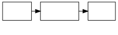
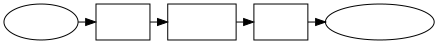

# 04 Discrete communication channel without noises

## 離散通信路

### 通信路

今までは情報についてを扱いましたが,今回は情報を伝送することについて扱います

情報を伝達する際にはその役割に応じて 3 つのモデルを考えることができます

- **送信機**...信号を発射
- **伝送路**...信号の伝わる経路
- **受信機**...信号が伝えられる

これら 3 つを合わせて**通信路**と言います

このような通信路は次の 2 つに分けることができます

- 連続通信路...無限個の連続信号を発生し伝送する
- 離散通信路...有限個の信号のみを発生し伝送する

更にこれを雑音があるものとないものに分けることができます.ここではこれまで離散値について扱ってきたので,離散通信路について考えます

### 符号化と復号化

情報源が$A_1, \cdots ,A_n$の n 文字のアルファベットを持つ時に,通信路の信号が$B_1,\cdots ,B_m$の m 種類しか持たないかもしれません

このとき,n 文字のアルファベットを m 種類の信号に変換する必要が有ります.この変換を**符号化**と言い,元に戻すことを**復号化**と呼びます

そのため,通信系のモデルは次のようになります

### 雑音のない通信路の容量

信号$B_i$の長さが$l_i$秒だと限られた情報しか伝えられません

信号系列の 1 信号当たりのエントロピーを$H$とします.符号機から$B_i$が出てくる確率は$p_i$で$l_i$秒かかるから 1 信号を送るのに平均して

$$
L = \sum p_i l_i
$$

秒の時間がかかります

1 秒当たり

$$
R = \frac{H}{L}
$$

ビットの情報が伝えられ,R を**情報伝送速度**と言います

今,最大 1 秒当たり何ビットの情報が送れるのか,と考えた時,都合の良い例での情報伝送速度を考えます

エントロピーは信号$B_i$が独立に出てくるときが大きいので

$$
H= - \sum_{i}p_i \log p_i
$$

ここで,$p_i$がどんな数のとき最大となるのか,つまり

$$
R(p_1, \cdots , p_m) = \frac{H}{L}
$$

を最大化する問題を考えます.$R$が最大のときの$p_i$を$\hat{p_i}$と書くと最大値は

$$
C = \underset{p_i}{max}R(p_1, \cdots , p_m) = R(\hat{p_1}, \cdots , \hat{p_m})
$$

を**通信路容量**と呼びます

C は次の定理から求めることができます

---

`定理4.1`

符号の長さが

$$
 \sum_{i} 2^{-Cl_{i}} = 1
$$

の正の根です.また情報を最大の速度で伝送するには信号$B_i$が確率

$$
\hat{p_i} = 2^{-Cl_{i}}
$$

で独立に発生すれば良い

---

---

`証明`

$$
\begin{aligned}
    H&= - \sum p \log p_i \\
    L&= \sum p_i l_i
\end{aligned}
$$

として

$$
R = \frac{H}{L}
$$

を

$$
\sum p_i = 1
$$

という制約条件で最大にすることが問題です

Lagrange の未定定数$\lambda$を使って

$$
S = R = \lambda (\sum p_i)
$$

を各$p_i$で微分して,それを 0 とすればほしい値は求まります

上の条件と共に

$$
\frac{\partial S}{\partial p_i} = \frac{\partial R}{\partial p_i} - \lambda \frac{\partial}{\partial p_i} \left(\sum p_i\right)
$$

であり,右辺を変形すると

$$
\begin{aligned}
\frac{\partial R}{\partial p_i} - \lambda \frac{\partial}{\partial p_i} \left(\sum p_i\right) &= -\frac{\frac{\partial}{\partial p_i}HL - H \frac{\partial}{\partial p_i}L}{L^2} - \lambda \\
&= - \frac{\frac{\partial}{\partial p_i}\sum p_i \log p_i}{L} - \frac{1}{L^2}(\frac{\partial}{\partial p_i}\sum p_i l_i)H - \lambda \\
&= - \frac{1}{L} \left(\log p_i - \left( \frac{p_i}{p_i \log e} \right)\right) - \frac{H}{L^2}l_i - \lambda\\
&= -\frac{H}{L^2}l_i - \frac{1}{L}(\log p_i + \log e) - \lambda
\end{aligned}
$$

ただし

- $(\frac{f(x)}{g(x)})' = \frac{f'(x)g(x) - f(x)g'(x)}{g^2(x)}$
- $(\log_a x)' = \frac{1}{x log a}$
- $- \frac{1}{\log x} = \log x$

を使っています

---

整理して

$$
\log p_i = - \frac{H}{L}l_i - \lambda L - \log e
$$

これを満たす$p_i$を$\hat{p_i}$と書きます

ここで両辺に$- p_i$を書けて,$i$について総和($\sum$)を取ると

$$
H = H + \left( \lambda L + \log e \right)
$$

となるから

$$
\lambda L + \log e = 0
$$

です.これを$\log p_i = - \frac{H}{L}l_i - \lambda L - \log e$に代入して

$$
\log \hat{p_i} = - \frac{H}{L}l_i
$$

が求まります.このとき

$$
C= \frac{H}{L}
$$

だから

$$
\hat{p_i} = 2C^{-Cl_i}
$$

です.$C$は$\sum p_i = 1$より

$$
\sum 2^{-Cl_i} = 1
$$

の根として求めれば良いです.この方程式はただ 1 つの正の根を持ちます

この定理は要は$l_i$が大きいほど$\hat{p_i}$が小さい,つまりあまり長い時間がかかる信号は使わない方が伝送速度が高くなるということです

---

`定理4.2`

通信路を通ることのできる信号系列のうちで,長さが$T$秒以内のものの総数を$N(T)$とします.すると

$$
C= \lim_{T \to \infty} \frac{log{N(T)}}{T}
$$

となります.この式の意味は$T$が十分大きい時,$N(T) \fallingdotseq 2^{CT}$と書けます

また,長さ$T$秒以内の信号系列の総数が$N(T)$であれば,$T$秒かかって送れる情報の量は$\log N(T) / T$ですが,これが正しく$C$であることを定理は主張しています

---

---

`証明`

長さ$T$秒以内の信号系列のうち,最後が$B_i$であるものを考えます

これらから最後の$B_i$を取り除くと$T -l_i$秒以内の信号系列となります.逆に$T-l_i$以内の信号系列の最後に$B_i$を付け加えると長さが$T$以内の信号系列となります

それぞれ個数は$N(T)$, $N(T - l_i)$個です

$N(T)$個のどの信号系列も最後は$B_i$で終わっているのでこれらを全て$B_i$について寄せ集めれば

$$
N(T) = \sum_{i=1}^{m} N(T-l_i)
$$

となります

$N(T) = a2^{\lambda T}$とおいて代入すると

$$
a2^{\lambda} = \sum_{i=1}^{m}a2^{\lambda (T-l_i)}
$$

となります.したがって,$\sum 2^{- \lambda l_i} = 1$が得られます

これを$\sum_i 2^{-C l_i}$と比較して

$$
\lambda = C
$$

したがって

$$
N(T) = a 2^{\lambda T} = a2^{CT}
$$

すなわち

$$
\lim_{T \to \infty}\frac{\log N(T)}{T} = \lim_{T \to \infty} \frac{\log a + CT}{T} = C
$$

---

### 符号化定理

通信路の能力をいっぱいに使えるような符号化が常に存在するとき

- 通信路の容量$C$は極めて普遍的な性格の量
- 情報源から発生する文字列は確率的に独立でなくても符号化後に独立な系列に変換できる

1 文字当たり$H$ビットのエントロピーを持つ情報源があり,1 秒当たり$C$ビットの容量を持つ通信路を通して情報を送りたい時,毎秒$C/H$文字送りたいです

これに関して Shannon によって,次の定理が示されています

---

`定理4.3`

1文字当たりのエントロピーが$H$の情報源と,単位時間あたり$C$の容量を持つ通信路があるとき,この通信路を使った単位時間あたり$(C/H - \varepsilon)$文字の割合で情報を送るような符号化がどんな小さな$\varepsilon > 0$に対しても存在する

---

---

`証明`

十分に大きな数Nを考えます

情報源から出るN文字の文字系列を考えます.これをひとまとめに符号化します

文字の種類をkとして,N文字の文字系列は全て合わせて$k^N$個有ります

$H_0 = \log k$として$2^{H_0 N}$と同じです.この中にはめった出てこない文字列も有ります

ここでは$2^{HN}$個だけよく出てくるとして他は無視します

その$2^{HN}$個に信号系列を1つずつ対応させると文字系列を信号系列にできるから符号化できたことになります

信号系列の長さがT秒以内として総数は$2^{CT}$だから

$$
2^{HN} = 2^{CT}
$$

となるTを決めれば文字系列と信号系列の数が同じに成るのでその変換は一対一対応となります.このとき

$$
\frac{N}{T}=\frac{C}{H}
$$

となります.$N/T$は符号化の際に送ることのできる1秒当たりの文字数で,これが$C/H$に等しいから理想的な符号化ができたことになります

では,$2^{HN}$個以外の無視してしまった文字系列が出てきた場合はどうするのかという問題があります

- まず$2^{H_0 N}$個ある文字系列の全体を$L_1$と$L_2$の2つの部分に分けます
  - $L_1$は出現確率がほぼ$2^{-HN}$の文字系列から成ります(エルゴード系列)
  - $L_2$は出現確率が$2^{-HN}$とは異なる文字系列から成ります(非エルゴード系列)
- 実際に出現するのは$L_1$のどれかです
- $L_2$が出現する確率$\delta$はNを大きくすればいくらでも小さくなります

次に前のTよりも少しだけ長い時間

$$
\frac{N}{T}=\frac{C}{H} - \eta
$$

を満たす時間Tを考えます(これは前のTと異なるTなので注意して下さい)

この時間内で通信路を通ることができる信号系列の数は

$$
2^{CT} = 2^{HN} + \eta^{TH}
$$

個です.$2^{CT} > 2^{HN}$だから$L_1$の$2^{HN}$個のエルゴード系列のうち1つが情報源から出た場合,$2^{CT}$の信号系列の1つを割り当てることが可能です

$L_2$の非エルゴード系列が発生した場合,こちらの方の個数は$2^{H_0 N}$個なので長さTの信号系列では全然足りないです.$L_2$の文字系列を表す信号系列として

$$
T_0 = \frac{H_0}{C}N
$$

として長さ$T_0$の信号系列を使う必要があります($T_0 > T$)

ここでは次のような符号化を用います

- 情報源からエルゴード部分に属する系列が出たらそれに対応する長さTの1つの信号系列を取り出し,それを送ります
  - 要する時間はT
- 非エルゴード部分が出たらこれから非エルゴード部分を送るというサインを送ります
  - このサインには長さTの信号系列の(エルゴード部分に対応していない)余った部分を使います
  - 次いで長さ$T_0$の信号系列を送ります
  - 要する時間は$T+T_0$

ところで,エルゴード部分の文字系列が発生する確率は$1- \delta$であり,非エルゴード部分が発生する確率は$\delta$だから平均して送るのにかかる時間は

$$
(1 - \delta)T + \delta (T + T_0) = T + \delta T_0
$$

この時間でN文字が送れたのだから,単位時間あたり

$$
\frac{N}{T+\delta T_0}
$$

文字が送れます.これを計算すると

$$
\begin{aligned}
    & \frac{N}{T + \delta T_0}~= \frac{C}{H} - \varepsilon\\
    & \varepsilon = \eta + \frac{CH_0}{H_0}\delta
\end{aligned}
$$

です.ただし単位は文字/秒です

ここで$\delta$はNを大きくすればいくらでも小さくなる量で,$\eta$もNを大きくするときいくらでも小さくしてよいです

だから,$\varepsilon$もいくらでも小さくなる量です

言い換えると任意の$\varepsilon > 0$に対してNを十分に大きくすれば符号化法で単位時間あたり$C/H - \varepsilon$文字の割合で情報が送れることが分かります

---

ここから効率のよい符号化とは$\varepsilon$の小さい符号化だということがわかります

しかし,N文字まとめて符号化を置こ成るのでNが大きいと符号化までの時間も送れます.また,符号化･復号化の手間も増します

この手間を惜しまなければ,符号化のいくらでも理想に近い符号化ができることをこの定理は保証しているというわけです

## 符号化による冗長度の除去

